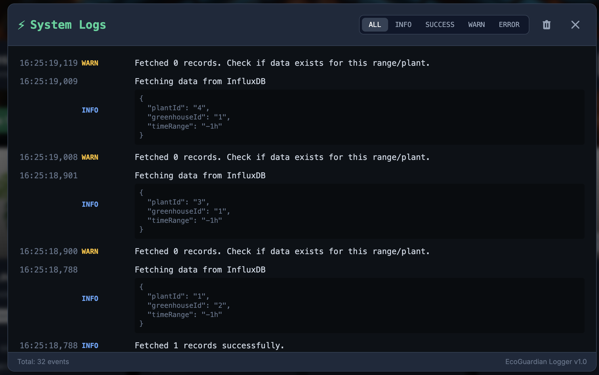
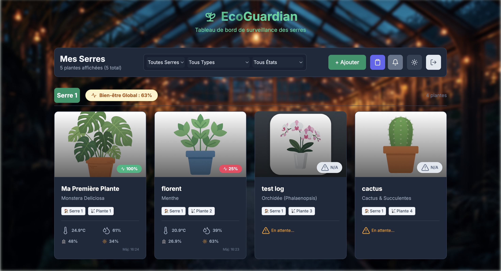
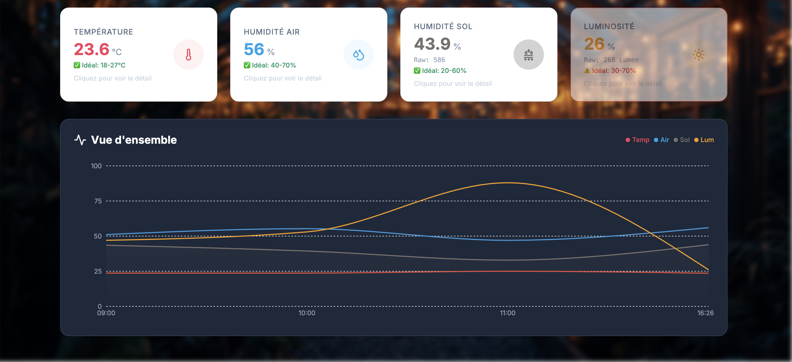
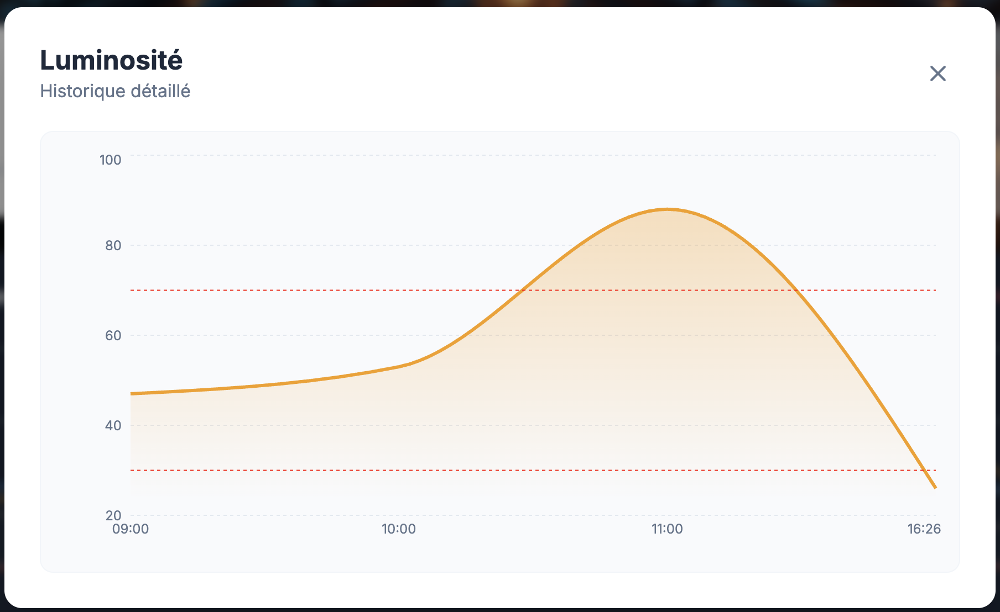
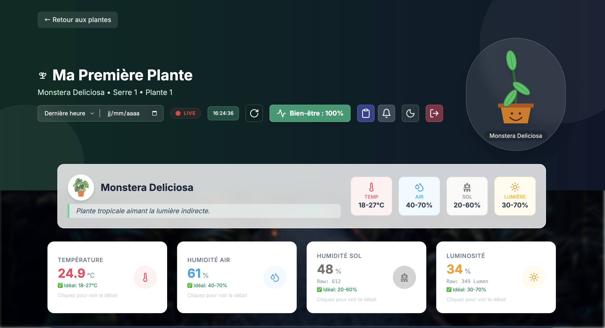

# EcoGuardian (Cloud & Infrastructure) - Un Campus qui vous comprend

## 📌 Contexte du Projet
**Projet :** « Un campus qui vous comprend »  
**Mandat :** Cellule d’ingénierie opérationnelle  
**Objectif :** Concevoir un système connecté, interopérable et fiable pour un environnement réel.

Le campus CESI lance un programme de modernisation numérique de ses bâtiments. Il ne s’agit plus de tests ou de maquettes isolées : le besoin est concret et les attentes sont élevées.

Notre mission est de concevoir et livrer un système IoT complet, interconnecté, fiable, sécurisé, et capable de rendre un vrai service au quotidien. Ce n'est pas un terrain de jeu technologique, mais un banc d’essai pour une future solution industrialisable.

---

## 🌍 Stack Technologique & Architecture

Cette architecture repose sur des composants robustes et automatisés, conteneurisés via **Docker**.

### 🧱 Services Fondamentaux

| Service | Rôle | Technologies Clés | Documentation |
| :--- | :--- | :--- | :--- |
| **Traefik** | Reverse Proxy & SSL | Go, Let's Encrypt, Docker Labels | [Voir Détails](./traefik/README.md) |
| **EcoGuardian Web** | Frontend Utilisateur | React, Vite, TypeScript, Tailwind | [Voir Détails](./ecoguardian-plant-monitor/README.md) |
| **Backend API** | Persistance & Logique | Node.js, Express, JSON-DB | [Voir Détails](./backend/README.md) |
| **InfluxDB** | Base de données TS | Time-Series, Flux Query | [Voir Détails](./influxdb/README.md) |
| **Authelia** | Sécurité Access (SSO) | Go, 2FA, OpenID Connect | [Voir Détails](./authelia/README.md) |
| **CrowdSec** | IPS / Anti-Intrusion | Threat Intel, Log Parsing | [Voir Détails](./crowdsec/README.md) |
| **Code Arduino** | Firmware IoT (Edge) | C++, LoRa, Cryptographie | [Voir Détails](./code_arduino/README.md) |

---

## 🏗️ Architecture du Système

Nous avons conçu une architecture distribuée et résiliente, capable de collecter, transmettre et valoriser des données en temps réel.

### Chaîne de Valeur de la Donnée
1.  **Capteurs (Edge)** : ESP32/Arduino avec capteurs Température, Humidité, Luminosité et humidité dans le Sol.
2.  **Transmission** : Protocole LoRa (Longue Portée) pour la liaison capteur-passerelle.
3.  **Transport (Broker)** : **Mosquitto** avec sécurisation TLS (MQTTS).
4.  **Traitement (Logic)** : **Node-RED** pour le déchiffrement, le filtrage et le routage.
5.  **Stockage (Time-Series)** : **InfluxDB** pour l'historisation.
6.  **Backend (API)** : **Node.js** pour la persistance centralisée de la configuration (liste des plantes) et des logs.
7.  **Visualisation** : Web App et Grafana.

---

## 🔐 Sécurité & Confidentialité de Bout en Bout

La sécurité n'est pas une option, c'est une fondation. Nous avons mis en place une stratégie de défense en profondeur.

### 1. Chiffrement Payload (Niveau Applicatif)
La donnée est chiffrée **dès sa création** sur le microcontrôleur.
- **Algorithme** : XTEA (eXtended Tiny Encryption Algorithm) avec clé 128 bits.
- **Principe** : Le capteur chiffre les données brutes avant l'envoi LoRa. La passerelle LoRa transmet les paquets chiffrés sans pouvoir les lire.

### 2. Transport Sécurisé (MQTTS) & HTTPS
Tout le trafic réseau est chiffré.
- **Interne** : MQTT over SSL/TLS.
- **Externe** : HTTPS forcés via Traefik + HSTS.
- **Protection Access** : Authelia protège les endpoints sensibles.

---

## 🚀 Fonctionnalités Clés "EcoGuardian"

### NOUVEAU : Persistance & Expérience Utilisateur
- **Logs Persistants** : Les événements système (alertes, ajouts de plantes) sont sauvegardés côté serveur et restitués au redémarrage.
- **Fond Dynamique** : L'interface s'adapte en temps réel (Cycle Jour/Nuit) avec des transitions fluides.
- **Notifications Configurables** : L'utilisateur peut choisir les types d'alertes (Erreur, Info, Succès) qu'il souhaite recevoir.

### Surveillance Temps Réel
L'application web offre une vue synthétique et esthétique.
- **Tableau de bord** : Température, Humidité Air/Sol, Luminosité.
- **Score de Bien-être** : Algorithme calculant la santé globale de la plante (0-100%).
- **Plante Virtuelle** : Avatar dynamique qui change d'humeur selon les données.

### Visualisation Avancée
Pour une analyse fine, des graphiques interactifs permettent de voir l'évolution des capteurs.

### Base de Données Intelligente
- Sélection parmi **9 profils de plantes** (Monstera, Cactus, Orchidée...).
- Seuils d'alerte adaptés automatiquement à chaque espèce.
- **Persistance Centralisée** : Les configurations sont sauvegardées côté serveur (Backend Node.js), permettant le partage instantané entre tous les utilisateurs (Mobile/Desktop).
- **Fiche Détail** : Affichage des besoins spécifiques de la plante sélectionnée.

---

## 🛠️ Installation & Déploiement

### Pré-requis
- Docker & Docker Compose
- Ports 80, 443 et 8086 ouverts sur le routeur
- Un nom de domaine (ex: DuckDNS)

### Services Déployés
Une fois le `docker-compose up -d` lancé, voici les accès :

| Service | Accès (URL/Port) | Authentification |
| :--- | :--- | :--- |
| **EcoGuardian App** | `https://ecoguardian.duckdns.org` | Authelia (2FA) |
| **Backend API** | `https://ecoguardian.duckdns.org/api` | Authelia (2FA) |
| **Authelia** (IdP) | `https://ecoguardian.duckdns.org/authelia` | - |
| **Traefik** (Proxy) | Port 80 / 443 | - |
| **Grafana** | `https://ecoguardian.duckdns.org/grafana` | Aucune (Interne) |
| **InfluxDB** | `https://ecoguardian.duckdns.org:8086` | Token / Login de base |

---

